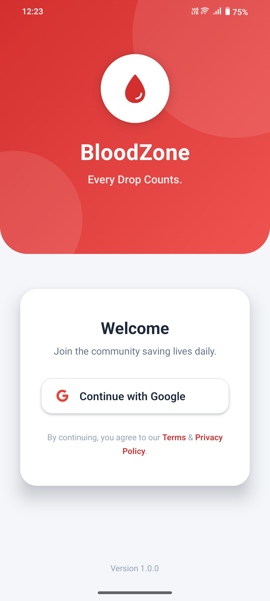
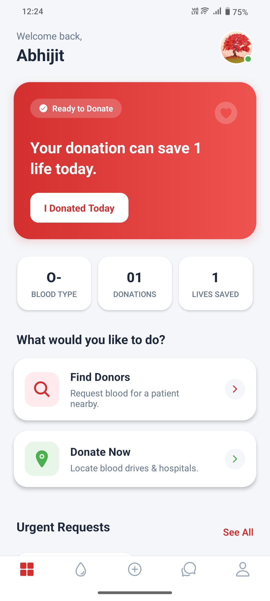
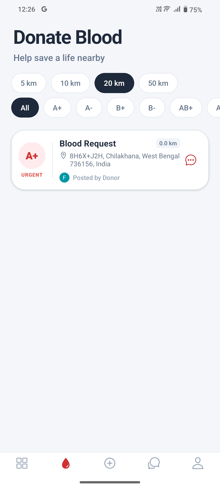
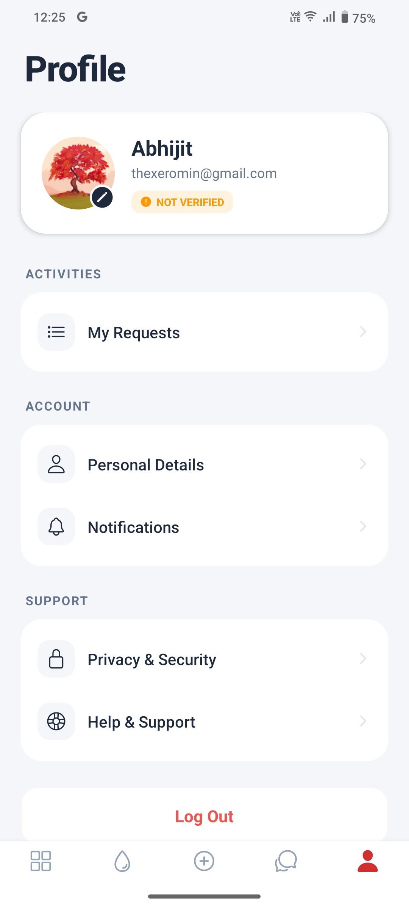

# 🩸 BloodZone

A real-time blood donation app that connects donors and seekers nearby, with a search radius you can adjust from 5km up to 50km.

## Screenshots

  
  
  
  

## Live Demo

- **🎥 Video Demo:** [YouTube](https://www.youtube.com/watch?v=Iv-OQy9J9Gw)

## What Makes BloodZone Different

### 1. Smart Location-Based Matching

Most directory-style apps just list every donor in a city. BloodZone instead uses **MongoDB's 2dsphere geospatial indexing** to run targeted queries that actually narrow things down:

- **Distance-based search:** Finds donors within a radius the requester chooses (5km, 10km, 20km, or 50km) using `$near` queries.
- **Eligibility check built in:** Automatically skips donors who gave blood in the last 3 months, so requesters only see people who can actually donate right now.

### 2. Secure Login with Google OAuth

Authentication runs through a **server-side Google OAuth 2.0 flow**, designed so sensitive tokens never touch the client:

- The raw auth code from Google is exchanged on the backend, not the frontend.
- Sessions are managed with a custom JWT setup (access + refresh tokens), so users stay logged in securely without constant re-authentication.

### 3. Real-Time Chat, Locked Down

Donors and seekers can message each other instantly through **Socket.io**, with authentication enforced at the connection level:

- A custom handshake middleware checks the JWT access token _before_ a socket connection is allowed to open.
- This keeps the chat closed to verified users only. So no anonymous listeners, no spam connections.

## Tech Stack

| Layer         | Technology          | Key Use Case                         |
| :------------ | :------------------ | :----------------------------------- |
| **Frontend**  | React Native (Expo) | Android (verified), iOS (beta)       |
| **Backend**   | Node.js + Express   | REST API                             |
| **Database**  | MongoDB (Mongoose)  | Geospatial indexing & data storage   |
| **Real-Time** | Socket.io           | Bidirectional, event-based messaging |
| **Auth**      | Google OAuth + JWT  | Secure identity management           |
